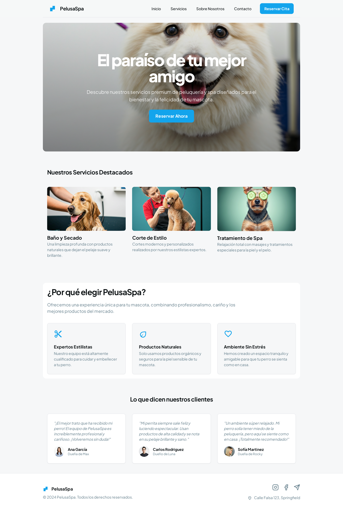
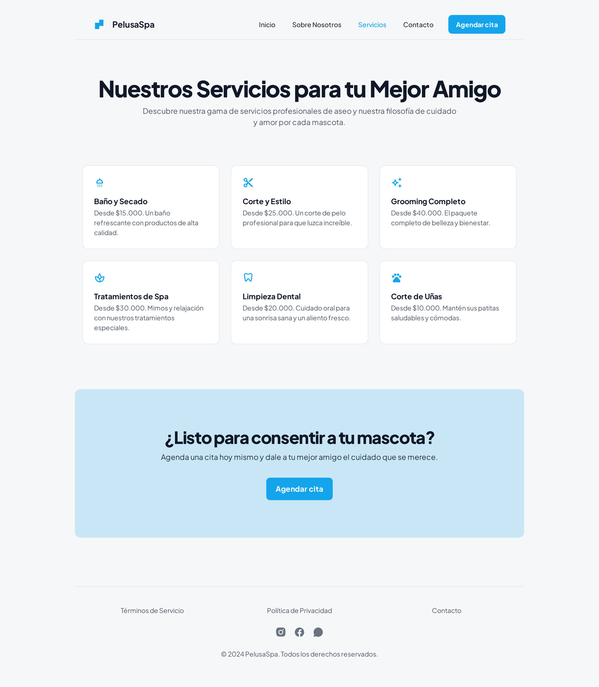
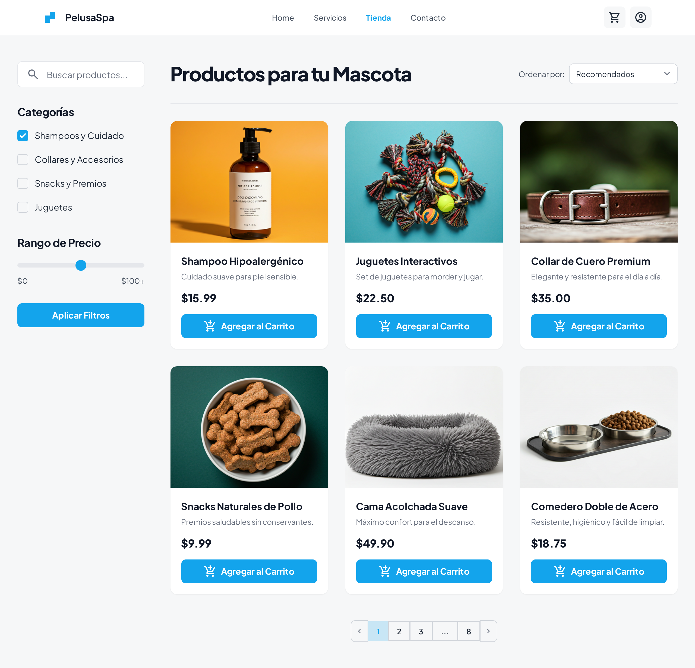
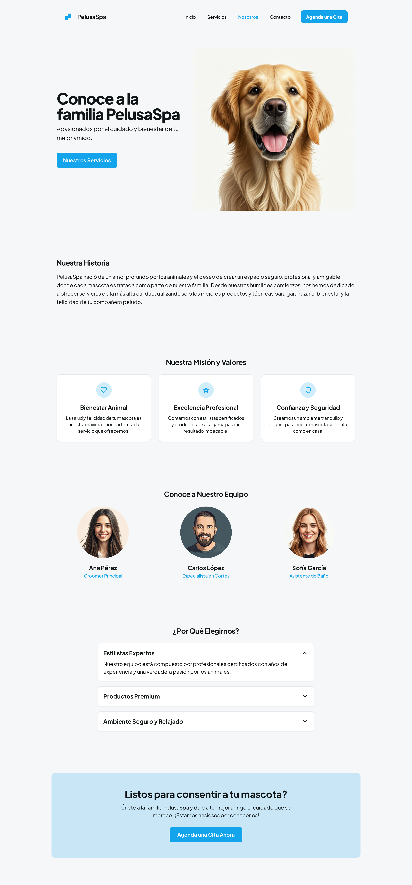
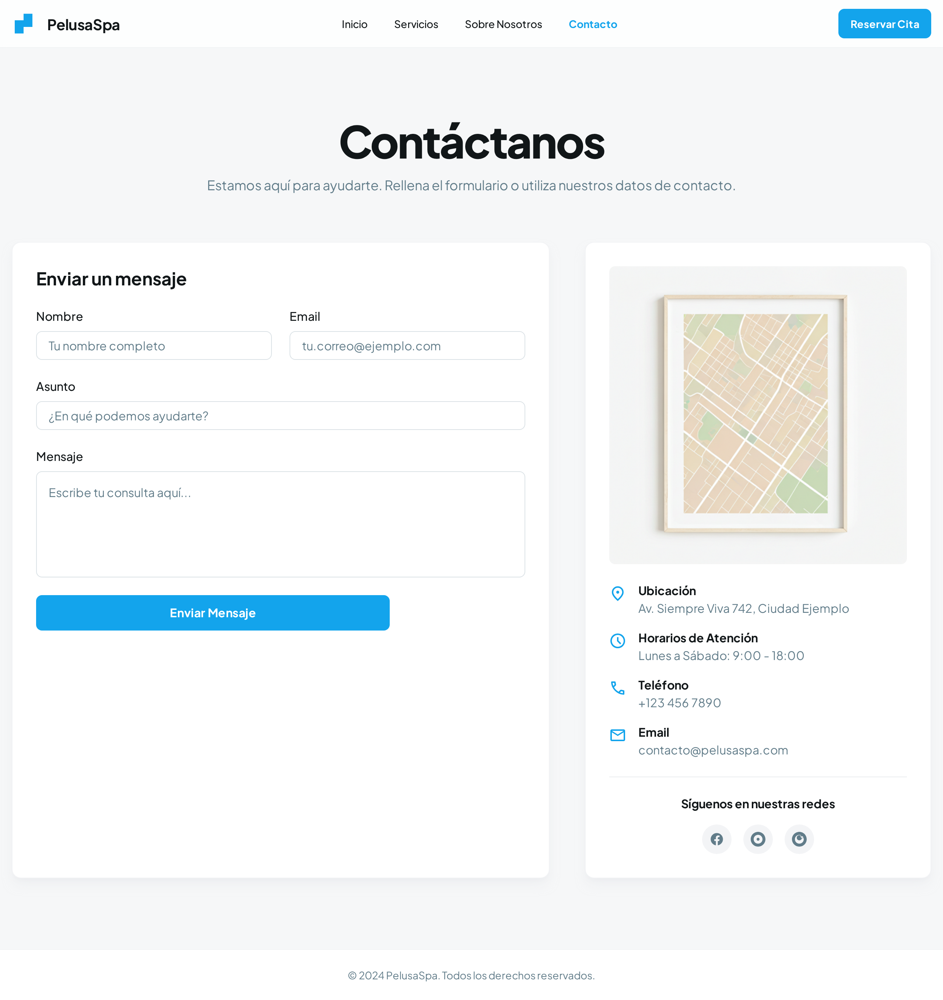
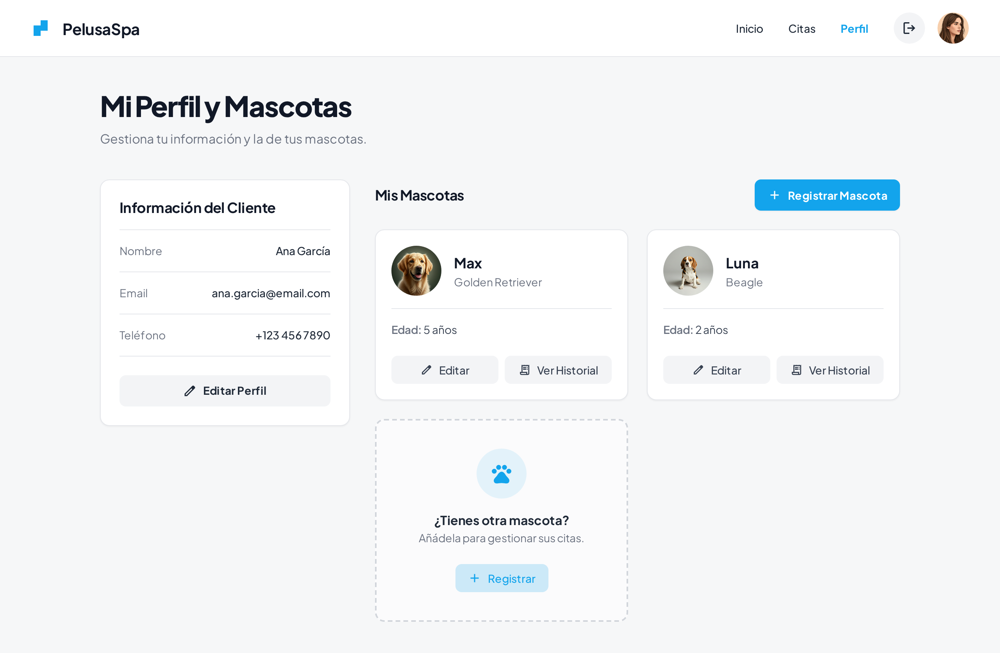
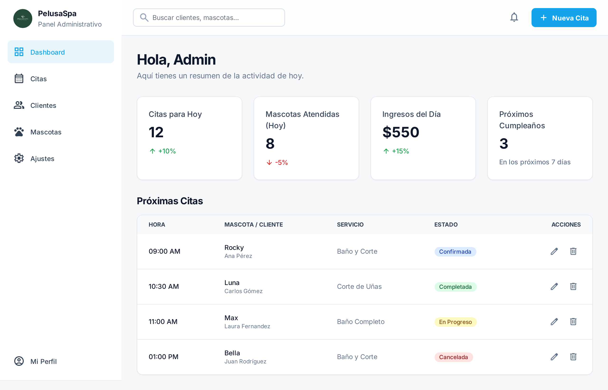

# Documentación del Prototipo de UI - PelusaSpa

Este documento detalla la implementación de la interfaz de usuario para **PelusaSpa**, una aplicación web para la gestión de servicios de estética y cuidado de mascotas.

## Flujo de la Aplicación

El prototipo cubre tres flujos principales de experiencia de usuario:

1.  **Flujo Público (Informativo y Comercial):** Permite a los visitantes conocer la marca, ver servicios, productos y contactar al negocio.
2.  **Flujo de Usuario (Gestión):** Permite a los clientes gestionar su perfil y sus mascotas, así como iniciar el proceso de reserva.
3.  **Flujo Administrativo (Back-office):** Una interfaz dedicada para que los administradores gestionen citas y vean métricas clave del negocio.

---

## Detalle de Pantallas

### 1. Página de Inicio (Home)

*   **Propósito:** Actuar como la página de aterrizaje principal, capturando la atención del usuario con una propuesta de valor clara y redirigiéndolo hacia la reserva de citas.
*   **Componentes Principales:**
    *   **Hero Section:** Imagen de fondo inmersiva con título llamativo y botón de llamada a la acción (CTA) "Reservar Ahora".
    *   **Servicios Destacados:** Grid de 3 tarjetas resumiendo los servicios principales.
    *   **Beneficios:** Sección "¿Por qué elegirnos?" con íconos y texto descriptivo.
    *   **Testimonios:** Tarjetas con opiniones de clientes y avatares.
*   **Captura de Pantalla:**
    

---

### 2. Catálogo de Servicios

*   **Propósito:** Detallar la oferta completa de servicios de la estética, incluyendo precios base y descripciones, para ayudar al usuario a decidir qué necesita su mascota.
*   **Componentes Principales:**
    *   **Encabezado de Sección:** Título y subtítulo descriptivo.
    *   **Grid de Servicios:** Tarjetas interactivas con íconos (Material Symbols), nombre del servicio, precio y descripción corta.
    *   **CTA Final:** Banner inferior invitando a agendar una cita tras ver los servicios.
*   **Captura de Pantalla:**
    

---

### 3. Tienda (Store)

*   **Propósito:** Mostrar los productos disponibles para la venta (e-commerce), permitiendo al usuario filtrar y buscar artículos específicos.
*   **Componentes Principales:**
    *   **Barra Lateral (Sidebar):** Filtros funcionales por búsqueda de texto, categorías (checkboxes) y rango de precio (slider).
    *   **Barra Superior de Listado:** Contador de resultados y selector de ordenamiento.
    *   **Tarjetas de Producto:** Imagen del producto, título, precio destacado y botón "Agregar al carrito".
*   **Captura de Pantalla:**
    

---

### 4. Nosotros (About Us)

*   **Propósito:** Generar confianza y conexión emocional con el cliente mostrando la historia, los valores y el equipo humano detrás de la marca.
*   **Componentes Principales:**
    *   **Historia (Split View):** Diseño de imagen a la izquierda y texto a la derecha contando el origen de la empresa.
    *   **Misión y Valores:** Tarjetas centradas con íconos representativos.
    *   **Equipo:** Perfiles circulares con foto, nombre y cargo de los estilistas.
*   **Captura de Pantalla:**
    

---

### 5. Contacto

*   **Propósito:** Proveer un canal directo de comunicación y localización física para los clientes.
*   **Componentes Principales:**
    *   **Formulario de Contacto:** Campos para nombre, email, asunto y mensaje.
    *   **Información de Ubicación:** Tarjeta lateral con mapa incrustado (imagen estática) y lista de datos (dirección, horarios, teléfono, email).
*   **Captura de Pantalla:**
    

---

### 6. Perfil de Usuario y Mascotas

*   **Propósito:** Permitir al usuario logueado ver su información personal y gestionar (ver/editar/agregar) a sus mascotas registradas.
*   **Componentes Principales:**
    *   **Tarjeta de Cliente:** Datos personales (Nombre, Email, Teléfono) con botón de edición.
    *   **Lista de Mascotas:** Tarjetas horizontales con foto de la mascota, raza, edad y botones de acción (Editar, Historial).
    *   **Empty State:** Tarjeta punteada para "Agregar nueva mascota".
*   **Captura de Pantalla:**
    

---

### 7. Reserva de Cita (Booking Flow)

*   **Propósito:** Guiar al usuario paso a paso a través del proceso de agendar un servicio. (La pantalla muestra el Paso 1 y 2).
*   **Componentes Principales:**
    *   **Barra de Progreso:** Indicador visual del avance en el proceso.
    *   **Selector de Servicio:** Tarjetas seleccionables con estado activo/inactivo visual.
    *   **Selector de Mascota:** Dropdown para elegir una mascota registrada o añadir una nueva.
    *   **Navegación:** Botones "Anterior" y "Siguiente".
*   **Captura de Pantalla:**
    

---

### 8. Panel Administrativo (Dashboard)

*   **Propósito:** Interfaz interna para que el staff administre el negocio.
*   **Componentes Principales:**
    *   **Sidebar de Navegación:** Menú lateral fijo con enlaces a las secciones administrativas.
    *   **Tarjetas de Estadísticas (KPIs):** Resumen numérico con indicadores de tendencia (flechas arriba/abajo).
    *   **Tabla de Citas:** Listado tabular con filas para hora, mascota/cliente, servicio, estado (con badges de color) y acciones.
*   **Captura de Pantalla:**
    
